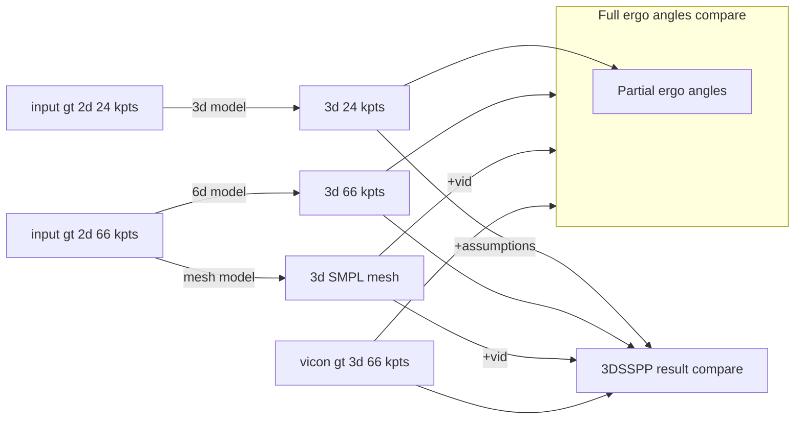

# Leyang notes

## Change config
add `joint_format: Hand-21` and `root_idx: 0`
## All hardcoded instances of 17 keypoints
- [x] When `arg.flip` is set to `True`, left and right keypoints idx in `lib\utils\utils_data.py` - `flip_data`
- [x] When `loss limb` is used, the limb index in `lib\model\loss.py` - `get_limb_lens(x)`
- [ ] When `angle loss` is used, the limb index in `lib\model\loss.py` - `get_angles(x)`
- [ ] `loss_mesh.py`, root idx
- [x] `args.args.rootrel`, both true and false, change `train.py` two instances
- [x] Root-relative Errors - calculating `batch_gt` in `train.py`
- [x] In `train.py`, `evaluation` function calculating `root_relative error`, multiple 0 index as pelvis
- [x] In data loader and data reader, keypoint number (17) and camera resolution hardcoded
- [x] set `args.discard_last_layer`
## Other common mistakes
- [x] Make sure the root_idx is set correctly when generating input dataset in `Vicon-read`, root-z should be 0
- [x] Make sure the file name, camera, activity sequence is the same sequence in the 2D and 3D. 

## Tasks
- [x] Train both config 2 and 6
- [x] test on industry video
- [x] show train and validation loss
- [x] find out what to set x, y when conf is 0, nan?
  - In H36M-MB pkl example, min confidence is 0.004, x, y is still normal pixel value. 
- [x] train on both fully processed & raw 2d

## 3D-6D-SMPL compare

## Mesh notes
Goal: format VEHS-7M mesh dataset and train on our own, get 66 GT 2D keypoints --> SMPL
- [x] Too big for mesh, downsample by 5
- [x] Motionbert takes SMPL, not SMPLX, need to convert
- [x] MotionBert take netual gender, need to convert
  - [ ] or train gender specific parameter `train_mesh.py` line 70 `smpl = SMPL(args.data_root, batch_size=1).cuda()`, change data_root to male/female pkl, add gender parameter
- [ ] Hard coded places for 17 h36m
  - [x] listed in todos
    - [ ] line 71 `smpl.J_regressor_h36m` make it not about h36m
    - [x] loss_mesh.py root idx `preds_local = preds['kp_3d'] - preds['kp_3d'][:, :, 0:1,:]  # (N, T, 17, 3)` 
  - [ ] For mesh train, only need to change meshLoss and compute_error, rest is for evaluate.

### 20240921
- env setup on mac, use 3.8 python, replace chumpy `pip install git+https://github.com/mattloper/chumpy`

## Hand notes
### 20240920
- Prepared new dataset, all flipped to right hand
- Set flip to false, rootrel to true

